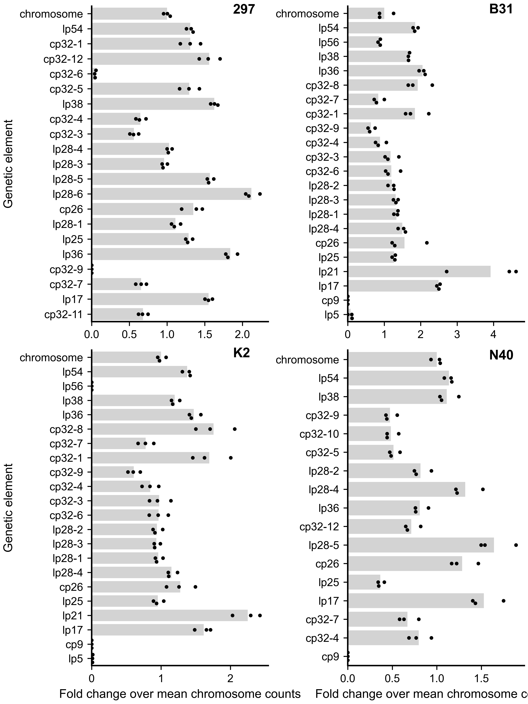

# Analysis of Bacterial Whole Genome Sequencing
## Purpose
When cloning or producing new *Borrelia burgdorferi* strains, one must verify the plasmid content in each new clone to make sure that they have not lost any of their plasmids. This code here therefore hopes to do the following. 
- Verify that there are no large-scale changes in the core genome from SNPs or other deletions. 
- Check that *B. burgdorferi* retains all of its plasmids. 

This code, provided as a ".ipynb" file, aims to check the copy number of *B. burgdorferi*'s plasmids. To do either, we purify gDNA from our bacterial strains and send them to SeqCenter, which returns raw *fastq.gz* sequence files. Aligning reads to reference genomes is easy. 
- Download your respective genome as a genbank file. I use the ".gbff" format. You can also concatenate at the end of this file the genbank-format sequence of any plasmid you wish to include for analysis. 
- Install [BreSeq](https://github.com/barricklab/breseq). This is the tool to use for alignments. It also produces a variant calling index to check for changes from the provided reference genome.

## Align sequences
Running BreSeq requires one line in the terminal, see below.
- Initialize breseq with "breseq."
- Load the genome file with "-r Bb\_N40.gbff," where "-r" tells breseq to read the reference file, then you tell it where the reference is.
- Load the two technical replicates for N40 sample 1 by spelling out their file names and locations.
- Run this on 6 cores of my computer with "-j6."
- Tell it where to save the alignments with "-o" and the relevant directory.
```bash
breseq -r genome_reference_files/Bb_N40.gbff sequence_files/N40_1_S281_R1_001.fastq.gz sequence/filesN40_1_S281_R2_001.fastq.gz -j6 -o variant_calling/N40_1 
```

## Analyze coverage
Refer to the ".ipynb" or ".html" files for the full analysis and annotated code. BreSeq produces ".bam" alignment files, which can be used to analyze sequence coverage and genetic element copy number. First, you define the basepair window from which you determine sequence coverage, shown below in **Figure 1**. 

<figure class="image">
  
  <figcaption><b>Figure 1.</b> Read coverage for whole genome sequencing. Three biological replicates of *B. burgdorferi* strain B31-IR. Each spot represents a biological replicate at a particular basepair coverage position.</figcaption>
</figure>


***NOTE.** The raw sequence and bam files are too large to include on GitHub. I expect to upload these to a public repository in the near future to accompany my manscript as revision experiments. Check back for a future commit in the next couple of months to specify where to find the data.

## Calculate copy number
After calculating coverage, you can use the average read counts and normalize them to the chromosome in each replicate. For all strains in this covered code, you can then plot the relative copy number (**Figure 2**). This tells us whether our strains are lacking any plasmids. 

<figure class="image">
  
  <figcaption><b>Figure 2.</b> Relative copy number for all plasmids. Using the reference genomes as a source, we can calculate whether our strains of interest have the requisite plasmids to constitute "wild-type." Strain 297, for example, lacks plasmids cp32-6 and cp32-9.</figcaption>
</figure>